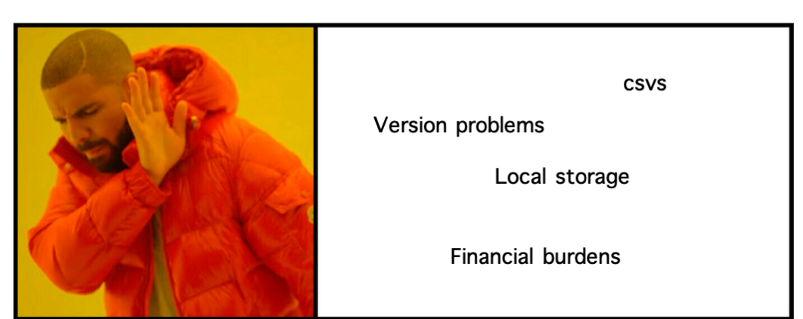
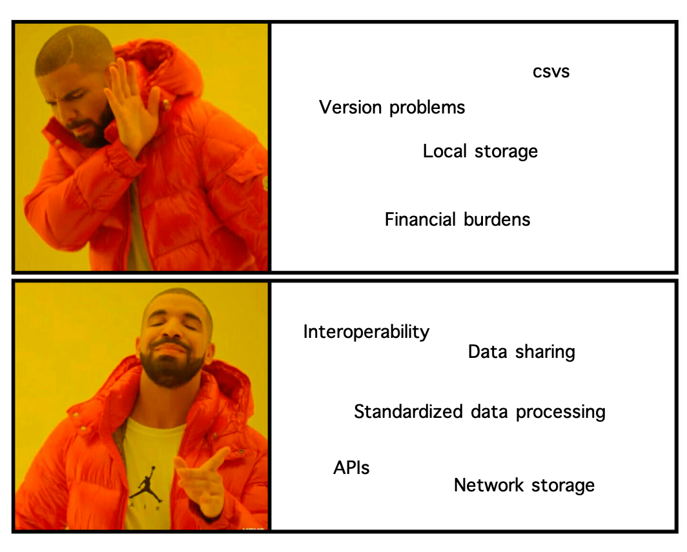
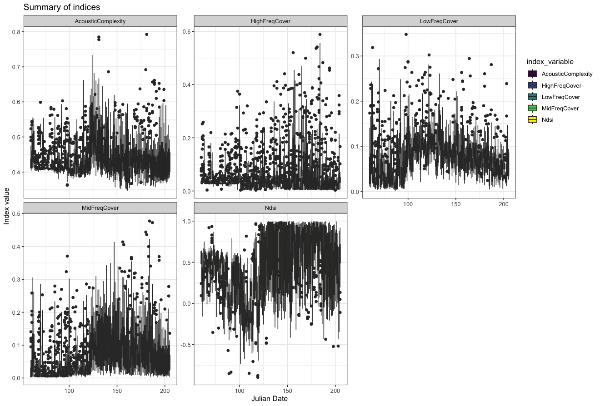
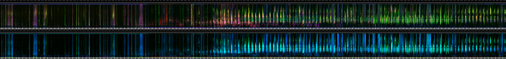
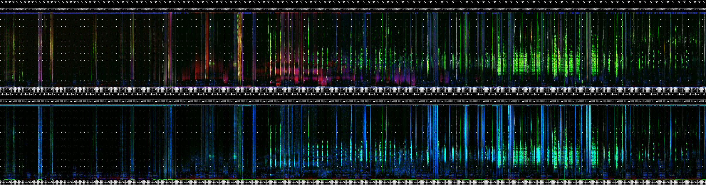
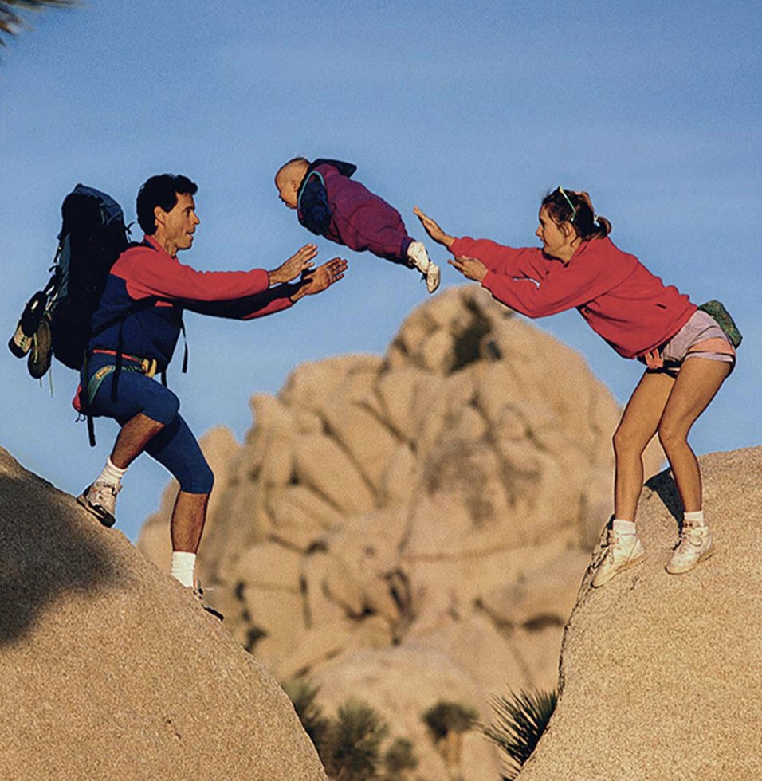
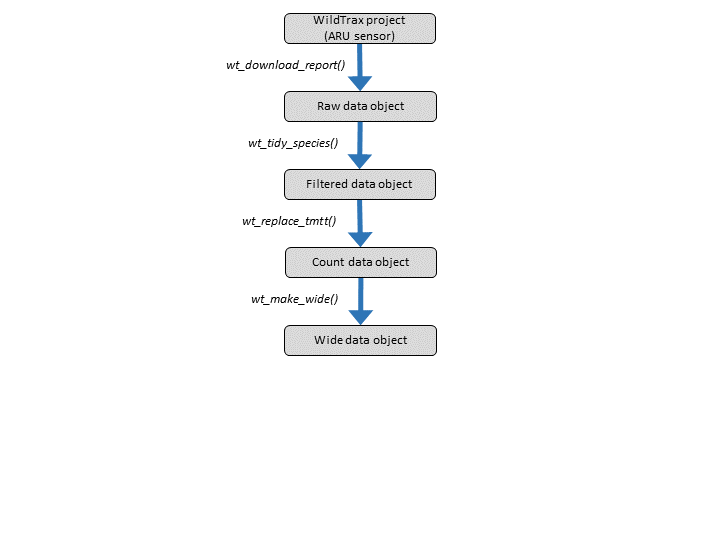
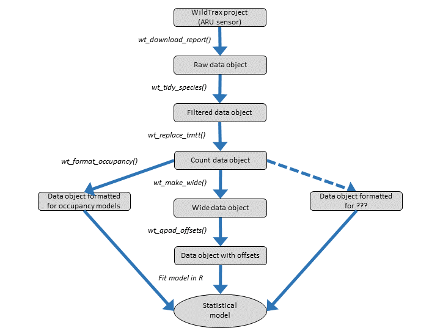
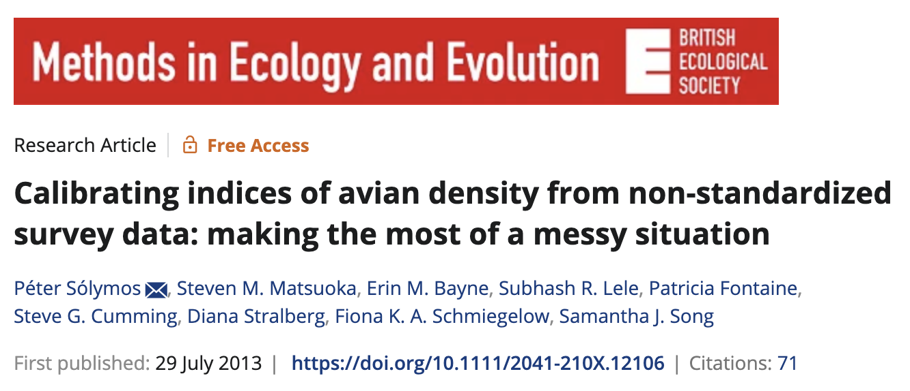
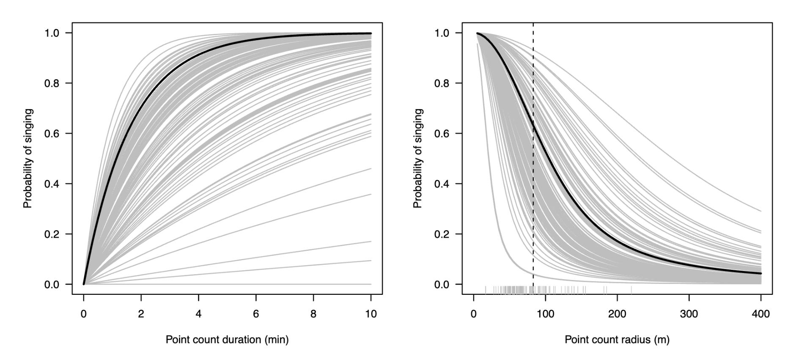

```{r setup, include = FALSE, eval = TRUE}

options(htmltools.dir.version = FALSE)

library(knitr)
library(wildRtrax)
library(tidyverse)

opts_chunk$set(
  #prompt = T,
  #fig.align="center", #fig.width=6, fig.height=4.5, 
  # out.width="748px", #out.length="520.75px",
  dpi=300, #fig.path='Figs/',
  cache=T#, echo=F, warning=F, message=F
  )

hook_source <- knitr::knit_hooks$get('source')
knitr::knit_hooks$set(source = function(x, options) {
  x <- stringr::str_replace(x, "^[[:blank:]]?([^*].+?)[[:blank:]]*#<<[[:blank:]]*$", "*\\1")
  hook_source(x, options)
})

```

```{css, echo=FALSE}
/* custom.css */
.left-code {
  color: #777;
  width: 40%;
  height: 92%;
  float: left;
}
.left-code-less {
  color: #777;
  width: 90%;
  height: 92%;
  float: left;
}
.right-plot {
  width: 58%;
  float: right;
  padding-left: 1%;
}
.right-plot-more {
  width: 65%;
  float: right;
  padding-left: 1%;
}
.plot-callout {
  height: 225px;
  width: 450px;
  bottom: 5%;
  right: 5%;
  position: absolute;
  padding: 0px;
  z-index: 100;
}
.plot-callout img {
  width: 100%;
  border: 4px solid #23373B;
}
body, h1, h2, h3, h4, h5, h6, p, ul, ol {
  font-family: "Agenda", sans-serif; font-size: 20px /* Replace "Agenda" with the actual font name */
}
.my-one-page-font {
  font-size: 18px;
}
.text-container {
            width: 300px; /* Set the width to your desired value in pixels or other units */
            margin: 0 auto; /* Center the container horizontally */
        }
.main-container { width: 1800px; max-width:2800px;}
.title-slide {
  background-image: url(hex-logo-pipit.png);
  background-position: 100% 0%;
  background-size: 400px;
  padding-left: 100px;  /* delete this for 4:3 aspect ratio */
}

```

# Preface

- We assume you're using an *environmental sensor* such as an **autonomous recording unit (ARU)** or **remote camera**

  
---

# Preface

- We assume you're using an *environmental sensor* such as an **autonomous recording unit (ARU)** or **remote camera**

--

- We assume you know [WildTrax](www.wildtrax.ca)

  - A web-enabled portal designed to manage, store, process, share and discover environmental sensor data, developed by the ABMI
  
--

- We assume you know *R*

  - A programming language mainly used for statistical computing and data analysis
  
---

# wildRtrax

## What is the `wildRtrax` R package?

- An R package for ecologists and advanced users who work with environmental sensors

- Contains functions designed to meet most needs in order to organize, analyze, and standardize data with the WildTrax infrastructure

--

## Why did you build `wildRtrax`?

- `wildRtrax` has been built in parallel<sup>1</sup> with WildTrax to provide additional analytics and functionalities

- By outlining a standardized and harmonized procedure for data intake, quality control, processing and verification of environmental sensor data,`wildRtrax` and WildTrax hope to provide open work flows for environmental sensors to help answer biological and ecological questions

---

# wildRtrax

## Who is `wildRtrax`?

- Us

--

- And (hopefully) **YOU**! (we'll show you how to contribute to the package)

---

# Today's Agenda

<br>

### 1. [Installing the package](#install)

### 2. [Pre-processing acoustic data](#preprocess)

### 3. [Downloading data from WildTrax](#download)

### 4. [Wrangling camera and acoustic data for analysis](#wrangle)

### 5. [Contributing to the package and submitting issues](#contribute)

---
class: center, top



---
class: center, middle
count: false
# #goals



---

class: inverse, center, middle
name: install

# Installing wildRtrax 

<html><div style='float:left'></div><hr color='#EB811B' size=1px width=1100px></html>

---

# Installing wildRtrax

<br>
### Download directly from Github using the `remotes` package:

```{r, eval=FALSE, include=TRUE, echo=TRUE}

remotes::install_github('ABbiodiversity/wildRtrax')

```

--

### Interested in recent fixes? Download the development branch instead, by including the **@development** tag:

```{r, eval=FALSE, include=TRUE, echo=TRUE}

remotes::install_github('ABbiodiversity/wildRtrax@development')

```

---

class: inverse, center, middle
name: preprocess

# Pre-Process Acoustic Data 

<html><div style='float:left'></div><hr color='#EB811B' size=1px width=1100px></html>

---

# Scanning acoustic data

```{r, echo=F, eval=T, warning=F, message=F}

load("webinar.RData")

```

```{r, echo=T, eval=F, warning=F, message=F}

# Load the package
library(wildRtrax)

# Plan futures for parellel processing
plan(strategy = multisession)

# Use the `wt_audio_scanner()` function to scan data
files <- wt_audio_scanner(path = ".", file_type = "wav", extra_cols = T)
```

---

# Scanning acoustic data

```{r, echo=T, eval=F, warning=F, message=F}

# Scan data
files <- wt_audio_scanner(path = ".", file_type = "wav", extra_cols = T)

```

```{r, echo=T, eval=T}

files

```

---

# Scanning acoustic data

```{r, eval=T, echo=T}

files %>%
  names()

```

--

- `location` (where the recording was taken)
- `recording_date_time` (when the recording was taken)

--

**`339-NW_20230528_071000.wav`**

--

You can also add arguments `extra_cols` (sample_rate, length_seconds, n_channels) or `tz` if you want to assign a timezone to the recordings.

```{r, eval=F, echo=T}

wt_audio_scanner(path = '.', file_type = 'wav', extra_cols = T, tz = 'US/Mountain')

```

---

# Filtering files

```{r, echo=T, eval=F, message=F, warning=F}
files %>%
  mutate(hour = lubridate::hour(recording_date_time)) %>%
  filter(julian %in% c(140:150),
         hour %in% c(4:8))

```

---
class: my-one-page-font

# Generating acoustic indices and LDFCs

### Running the [QUT Ecoacoustics Analysis Program](https://ap.qut.ecoacoustics.info/) on your audio files

<br>

.left-code[
```{r, echo=T, eval=F, warning=F, message=F}
# Use the files tibble to execute AP on them
wt_run_ap(
  x = files, 
  output_dir = 'ap_outputs', 
  path_to_ap = '/where/you/store/AP')

results <- wt_glean_ap(
  files, 
  input_dir = ".../ap_outputs", 
  purpose = "biotic")

# The indices
results[[2]]

```
]



---

# Acoustic indices and LDFCs

## Long-duration false-colour spectrogram

```{r, echo=T, eval=F}
results[[3]]
```



**March** &nbsp; &nbsp; &nbsp; &nbsp; &nbsp; &nbsp; &nbsp; &nbsp; &nbsp; &nbsp; &nbsp; &nbsp; &nbsp; &nbsp; &nbsp; &nbsp; &nbsp; &nbsp; **April** &nbsp; &nbsp; &nbsp; &nbsp; &nbsp; &nbsp; &nbsp; &nbsp; &nbsp; &nbsp; &nbsp; &nbsp; &nbsp; &nbsp; &nbsp; &nbsp; **May** &nbsp; &nbsp; &nbsp; &nbsp; &nbsp; &nbsp; &nbsp; &nbsp; &nbsp; &nbsp; &nbsp; &nbsp; &nbsp; &nbsp; &nbsp; &nbsp; **June** &nbsp; &nbsp; &nbsp; &nbsp; &nbsp; &nbsp; &nbsp; &nbsp; &nbsp; &nbsp; &nbsp; &nbsp; &nbsp; &nbsp; &nbsp; &nbsp; **July**

---

# Acoustic indices and LDFCs

## Manipulating the results

```{r, echo=T, eval=F}
wt_glean_ap(files %>%
              mutate(hour = lubridate::hour(recording_date_time)) %>%
              filter(hour %in% c(0:3,21:23)), 
            input_dir = "../ap_outputs", purpose = "biotic")
```

--



---

# Creating tasks and tags

## Upload recordings and generate tasks simulatenously

> Go to a Project and select **Manage** > **Upload Recordings to Project**

```{r, eval=F, echo=T, message=F, warning=F}

# Choose recordings for the ABMI Stratified Design for Ecosystem Health

tasks <- files %>%
  inner_join(abmi_blocks, by = c("julian" = "julian", "time_index" = "time_index")) %>%
  drop_na(blocks) %>%
  group_by(location, blocks) %>%
  sample_n(1, replace = F) %>%
  ungroup() %>%
  map(.x = .$file_path, .f = ~file.copy(.x, to = "/my/selected/files"))
```

---

# Creating tasks and tags

## Upload recordings and create tasks later

> Go to the Organization > Recordings > Manage > Upload Recordings and create tasks later using `wt_make_aru_tasks()`

<br>
```{r, eval=F, echo=T, message=F, warning=F}
my_tasks <- wt_make_aru_tasks(
  tasks,
  output = NULL,
  task_method = "1SPT",
  task_length = 180
)
```

---

# Creating tasks and tags

.pull-left[

## From Songscope

```{r, eval=F, echo=T, warning=F, message=F}
# Generate a tag csv to upload to WildTrax 
wt_songscope_tags(
  input,
  output = "env",
  my_output_file = NULL,
  species_code = "CONI",
  vocalization_type = "CALL",
  score_filter = 50,
  method = "USPM",
  task_length = 180
)

```
]

.pull-right[

## From Kaleidoscope

```{r, eval=F, echo=T, warning=F, message=F}
# Generate a tag csv to upload to WildTrax 
wt_kaleidoscope_tags(
  input = "kaleidoscope_output.txt",
  output = "my_bat_tags.csv",
  freq_bump = 20000)

```

]
---

# Another day perhaps...

- `wt_signal_level()` detects signals in audio based on amplitude thresholds
- `wt_chop()` divides a large audio file into shorter segments
- `wt_location_distances()` takes input latitude and longitudes and computes the distances between each set of valid points

---

# Handing it off to Marcus!

<div align="center">
 
</div>

---

class: inverse, center, middle
name: download

# Downloading Data 

<html><div style='float:left'></div><hr color='#EB811B' size=1px width=1100px></html>

---

# Authenticating into WildTrax

### First we need to set up our username and password as **environment variables**.

### Note: These need to be called `WT_USERNAME` and `WT_PASSWORD`, respectively. 

```{r, echo=TRUE, eval=FALSE, message=FALSE, include=TRUE}

Sys.setenv(WT_USERNAME = "guest", WT_PASSWORD = "Apple123")

```

--

These values live only on your device. But **be careful** about including sensitive information in a script that you may (inadvertently) share!

--

One solution - save a login script file locally<sup>1</sup>:

```{r, echo=TRUE, eval=FALSE, message=FALSE, include=TRUE}

credentials <- "Sys.setenv(WT_USERNAME = 'guest', WT_PASSWORD = 'Apple123')"
writeLines(credentials, "login.R")

# Then, are the top of your data download script, source the file
source("login.R")

```

--
.footnote[
<sup>1</sup> You can also use the `keyring` package for secure storage of your credentials locally.]

---

# Authenticating into WildTrax

```{r echo=TRUE, eval=TRUE, message=TRUE, include=TRUE, cache = TRUE}

# Now, all you need to do is run one function. With no arguments!!!

wt_auth() #<<

```

---
count:false

# Authenticating into WildTrax

```{r echo=TRUE, eval=TRUE, message=TRUE, include=TRUE, cache = TRUE}

# Now, all you need to do is run one function. With no arguments!!!

wt_auth() 

```
<br>
**So what's going on beneath the hood?**

```{r, echo=TRUE, eval=TRUE, message=TRUE, include=TRUE}

# Upon attachment, wildRtrax creates a new hidden environment (`._wt_auth_env_`) 
# wt_auth() obtains an Auth0 token from WildTrax and stores it in this environment,
# along with some other values. 

str(names(wildRtrax:::._wt_auth_env_)) #<<

```

--

```{r, echo=TRUE, eval=TRUE, message=TRUE, include=TRUE}

# For example, your token expires after 12 hours. Check it's expiry time:
wildRtrax:::._wt_auth_env_$expiry_time #<<

```

---

# So what?

--

### Well, now you can interact with your data directly in R!

```{r, echo=TRUE, eval=TRUE, message=TRUE, include=TRUE, cache = TRUE}

# Your Auth0 token can be supplied to functions that call the WildTrax API. #<<

# Which camera/ARU projects do you have access to? Use the `wt_get_download_summary` function.
my_projects <- wt_get_download_summary( 
  sensor_id = "CAM"
)

```

```{r, echo=FALSE, eval=TRUE, message=TRUE, include=TRUE, cache = TRUE}

my_projects <- my_projects %>% filter(organization == "ABMI")

```

```{r, echo=TRUE, eval=TRUE, message=TRUE, include=TRUE, cache = TRUE}

glimpse(my_projects, width = 75)

```


---

# So what?

The **[`wt_download_report()`](https://abbiodiversity.github.io/wildRtrax/reference/wt_download_report.html)** function mimics the data download on the WildTrax website.

You need to supply the `project_id` value, which we can get from **[`wt_get_download_summary()`](https://abbiodiversity.github.io/wildRtrax/reference/wt_get_download_summary.html)**.

--

```{r echo=TRUE, eval=TRUE, message=TRUE, include=TRUE}

# Let's say we're interested in the ABMI's Ecosystem Health project from 2014

# Obtain the project_id value
wt_get_download_summary(sensor_id = "CAM") %>%
  filter(project == "ABMI Ecosystem Health 2014") %>%
  select(project_id) %>%
  pull()

```

---

# Download data directly into R

<br>

```{r, echo=TRUE, eval=FALSE, message=TRUE, include=TRUE}

eh14_raw <- wt_download_report(
  project_id = 205, #<<
  sensor_id = "CAM",
  report = "main", #<<
  weather_cols = FALSE
)

```

```{r, echo=FALSE, eval=TRUE, message=FALSE, include=FALSE, cache = TRUE}

eh14_raw <- wt_download_report(
  project_id = 205,
  sensor_id = "CAM",
  report = "main",
  weather_cols = FALSE
)

```

---

# A nice dataframe!

<br>

```{r}
eh14_raw %>% select(1:15) %>% glimpse(width = 75) #<<
```

---

# What about two projects at once?

That's easy too!

```{r echo=TRUE, eval=TRUE, message=TRUE, include=TRUE}

# This time, we want ABMI's Camera Model Comparison projects, from
# three separate years. 

model_comp_ids <- wt_get_download_summary(sensor_id = "CAM") %>% 
  filter(str_detect(project, "Camera Model Comparison")) %>% #<<
  select(project_id) %>%
  pull() 

# The object model_comp_ids is a numeric vector
model_comp_ids

```

---

# What about two projects at once?

```{r echo=TRUE, eval=FALSE, message=TRUE, include=TRUE}

# To avoid a for loop ...

library(purrr)

# Now we can feed all 3 values in project_list into `wt_download_report()`.
model_comp_raw <- map_df(.x = model_comp_ids,
                         .f = ~ wt_download_report(
                           project_id = .x,
                           sensor_id = "CAM",
                           report = "main",
                           weather_cols = FALSE))
                         
```


```{r echo=TRUE, eval=TRUE, message=TRUE, include=FALSE, cache = TRUE}

model_comp_raw <- map_df(.x = model_comp_ids,
                      .f = ~ wt_download_report(
                        project_id = .x,
                        sensor_id = "CAM",
                        report = "main",
                        weather_cols = FALSE
                      ))

```

---

# Stitched together nicely

<br>

```{r}

model_comp_raw %>% select(1:15) %>% glimpse(width = 75)

```

---

# Available report types

.pull-left[
## Camera:

1. main
1. location
1. tag
1. image_report
1. image_set
1. project
1. megadetector
1. megaclassifier
]

.pull-right[
## ARU:

1. main
1. location
1. tag
1. recording
1. project
1. birdnet
]

<br>

### All definitions are available from the [WildTrax guide](https://wildtrax.ca/resources/user-guide/#data-download-and-data-discover).

---

# So what?

"You've made a slightly slicker version of `read.csv()`. Big deal."

--

<br>

Well, there are benefits to scripting:

+ Always get the most up-to-date version of the data.
+ Your collaborators are working off the same data that you are.
+ Reproducibility! 
+ Storage schmorage. 

---

class: inverse, center, middle
name: wrangle

# Wrangling Camera Data

<html><div style='float:left'></div><hr color='#EB811B' size=1px width=1100px></html>

---

# Transform our camera data

Most of the time, there are additional steps we want to take to transform our data into something more insightful or useful - for, say, modeling.

--

One common task: evaluating **independent detections**.

--

+ There's a function in wildRtrax for that: [`wt_ind_detect()`](https://github.com/ABbiodiversity/wildRtrax/blob/main/R/wt_ind_det.R).
+ It's designed to work with the output (i.e. "main" report) from [`wt_download_report()`](https://github.com/ABbiodiversity/wildRtrax/blob/main/R/wt_summarise_cam.R).
+ You specify the detection threshold. 

--

```{r echo=TRUE, eval=TRUE, message=FALSE, warning=FALSE, include=TRUE, cache = TRUE}

# Back to the Ecosystem Health 2014 data.

eh14_detections <- wt_ind_detect(
  x = eh14_raw,
  threshold = 30,
  units = "minutes",
  remove_human = TRUE,
  remove_domestic = TRUE
)

```

---
count:false

# Transform our camera data

Most of the time, there are additional steps we want to take to transform our data into something more insightful or useful - for, say, modeling.

One common task: evaluating **independent detections**.

+ There's a function in wildRtrax for that: [`wt_ind_detect()`](https://github.com/ABbiodiversity/wildRtrax/blob/main/R/wt_ind_det.R).
+ It's designed to work with the output (i.e. "main" report) from [`wt_download_report()`](https://github.com/ABbiodiversity/wildRtrax/blob/main/R/wt_summarise_cam.R).
+ You specify the detection threshold. 

```{r echo=TRUE, eval=FALSE, message=TRUE, include=TRUE}

# Back to the Ecosystem Health 2014 data.

eh14_detections <- wt_ind_detect(
  x = eh14_raw, #<<
  threshold = 30,
  units = "minutes",
  remove_human = TRUE,
  remove_domestic = TRUE
)

```

---
count:false

# Transform our camera data

Most of the time, there are additional steps we want to take to transform our data into something more insightful or useful - for, say, modeling.

One common task: evaluating **independent detections**.

+ There's a function in wildRtrax for that: [`wt_ind_detect()`](https://github.com/ABbiodiversity/wildRtrax/blob/main/R/wt_ind_det.R).
+ It's designed to work with the output (i.e. "main" report) from [`wt_download_report()`](https://github.com/ABbiodiversity/wildRtrax/blob/main/R/wt_summarise_cam.R).
+ You specify the detection threshold. 

```{r echo=TRUE, eval=FALSE, message=TRUE, include=TRUE}

# Back to the Ecosystem Health 2014 data.

eh14_detections <- wt_ind_detect(
  x = eh14_raw, 
  threshold = 30, #<<
  units = "minutes", #<<
  remove_human = TRUE,
  remove_domestic = TRUE
)

```

---
count:false

# Transform our camera data

Most of the time, there are additional steps we want to take to transform our data into something more insightful or useful - for, say, modeling.

One common task: evaluating **independent detections**.

+ There's a function in wildRtrax for that: [`wt_ind_detect()`](https://github.com/ABbiodiversity/wildRtrax/blob/main/R/wt_ind_det.R).
+ It's designed to work with the output (i.e. "main" report) from [`wt_download_report()`](https://github.com/ABbiodiversity/wildRtrax/blob/main/R/wt_summarise_cam.R).
+ You specify the detection threshold. 

```{r echo=TRUE, eval=FALSE, message=TRUE, include=TRUE}

# Back to the Ecosystem Health 2014 data.

eh14_detections <- wt_ind_detect(
  x = eh14_raw, 
  threshold = 30,
  units = "minutes",
  remove_human = TRUE, #<<
  remove_domestic = TRUE #<<
)

```

---

# Transform our camera data

```{r echo=TRUE, eval=TRUE, message=TRUE, include=TRUE}

glimpse(eh14_detections, width = 75) #<<

```

--

**313** independent detections in this dataset, when using a threshold of 30 minutes.

---

# Our main engine

The output from `wt_ind_detect()` gave us some useful information. 

--

But we probably need to do additional wrangling for our data to be in the proper format for certain modeling techniques (e.g. habitat modeling, occupancy).

For example, we want to evaluate the number of detections in a specified time interval (e.g. daily, weekly, or monthly), *including zeroes*. 

--

<br>

## So the ⭐ of the show is: [**`wt_summarise_cam()`**](https://github.com/ABbiodiversity/wildRtrax/blob/main/R/wt_summarise_cam.R)

---

# Summarise your camera data

## [**`wt_summarise_cam()`**](https://github.com/ABbiodiversity/wildRtrax/blob/main/R/wt_summarise_cam.R)

<br>

### You specify the following arguments:
<br>
+ The output from `wt_ind_detect()` (e.g. the object `eh14_detections`)

+ Your raw data (e.g. the object `eh14_raw`)

+ The time interval you're interested in (e.g. weekly)

+ The variable you're interested in (e.g. detections, presence/absence)

+ The desired output format ('wide' or 'long')

---

# Summarise your camera data

<br>

```{r eval=FALSE, echo=TRUE, include=TRUE}

# A call to `wt_summarise_cam()`:

eh14_summarised <- wt_summarise_cam(
  detect_data = eh14_detections_45s,
  raw_data = eh14_raw,
  time_interval = "week",
  variable = "detections",
  output_format = "wide"
)

```

---
count:false

# Summarise your camera data

<br>

```{r eval=FALSE, echo=TRUE, include=TRUE}

# A call to `wt_summarise_cam()`:

eh14_summarised <- wt_summarise_cam(
  # Supply your detection data #<<
  detect_data = eh14_detections_45s, #<<
  raw_data = eh14_raw,
  time_interval = "week",
  variable = "detections",
  output_format = "wide"
)

```

---
count:false

# Summarise your camera data

<br>

```{r eval=FALSE, echo=TRUE, include=TRUE}

# A call to `wt_summarise_cam()`:

eh14_summarised <- wt_summarise_cam(
  # Supply your detection data
  detect_data = eh14_detections_45s,
  # Supply your raw image data #<<
  raw_data = eh14_raw, #<<
  time_interval = "week",
  variable = "detections",
  output_format = "wide"
)

```

---
count:false

# Summarise your camera data

<br>

```{r eval=FALSE, echo=TRUE, include=TRUE}

# A call to `wt_summarise_cam()`:

eh14_summarised <- wt_summarise_cam(
  # Supply your detection data
  detect_data = eh14_detections_45s,
  # Supply your raw image data
  raw_data = eh14_raw,
  # Now specify the time interval you're interested in #<<
  time_interval = "week", #<<
  variable = "detections",
  output_format = "wide"
)

```

---
count: false

# Summarise your camera data

<br>

```{r eval=FALSE, echo=TRUE, include=TRUE}

# A call to `wt_summarise_cam()`:

eh14_summarised <- wt_summarise_cam(
  # Supply your detection data
  detect_data = eh14_detections_45s,
  # Supply your raw image data
  raw_data = eh14_raw,
  # Now specify the time interval you're interested in 
  time_interval = "week",
  # What variable are you interested in? #<<
  variable = "detections", #<<
  output_format = "wide"
)

```

---
count: false

# Summarise your camera data

<br>

```{r eval=FALSE, echo=TRUE, include=TRUE}

# A call to `wt_summarise_cam()`:

eh14_summarised <- wt_summarise_cam(
  # Supply your detection data
  detect_data = eh14_detections_45s,
  # Supply your raw image data
  raw_data = eh14_raw,
  # Now specify the time interval you're interested in 
  time_interval = "week",
  # What variable are you interested in?
  variable = "detections",
  # Your desired output format (wide or long) #<<
  output_format = "wide" #<<
)

```

---

# The ultimate pipeline

```{r eval=FALSE, echo=TRUE, include=TRUE}

library(wildRtrax)
Sys.setenv(WT_USERNAME = "*****",
           WT_PASSWORD = "*****")
wt_auth()


data <- wt_get_download_summary("CAM") %>%
  filter(project == "ABMI Ecosystem Health 2014") %>%
  select(project_id) %>%
  pull() %>%
  unlist() %>%
  wt_download_report("CAM")


summarised <- wt_ind_detect(data, 30, "minutes") %>%
  wt_summarise_cam(data, "day", "detections", "long")

```
--
<br>
**And now you can get straight into the science!!**

---

class: inverse, center, middle
name: wrangle

# Wrangling Acoustic Data 

<html><div style='float:left'></div><hr color='#EB811B' size=1px width=1100px></html>

---

# Acoustic wrangling workflow

### Part 1: Data wrangling

.center[]

.footnote[Note: we'll be reviewing the functions in this order but they can also be used independent of each other]

---

# Acoustic wrangling workflow

### Part 2: Data analytics

.center[]

---

# Part 1: Data wrangling 

### So now you have some processed acoustic data.

### Let's look at some wrangling functions to prepare your data for analysis.

---

# Recall: data download

```{r, echo=TRUE, eval=TRUE, message=FALSE, include=TRUE, cache=TRUE}

# Authenticate:

wt_auth()

# What are the projects we can access?

my_projects <- wt_get_download_summary(sensor_id = "ARU")

```

---

# PSA

### There is a *LOT* of public acoustic data available in WildTrax!!!

--

```{r, echo=TRUE, eval=TRUE, message=FALSE, include=TRUE}

glimpse(my_projects %>% 
  filter(status %in% c("Published - Public", "Published - Map+Report Only")) %>% 
  select(-organization_id, -status))

```
**87 projects!**

--

```{r, echo=TRUE, eval=TRUE, message=FALSE, include=TRUE}

sum(my_projects$tasks)

```
**Almost half a million tasks!**

---

# Recall: Data Download

### Ok PSA over, let's get some data:

```{r, echo=TRUE, eval=TRUE, message=FALSE, include=TRUE}

# Pick something small
set.seed(12345)
my_project <- my_projects %>% 
  filter(status %in% c("Published - Public", "Published - Map+Report Only"),
         tasks < 200) %>% 
  sample_n(1)

# What did we get?
my_project$project

```

---

# Recall: data download

### Note: The functions we're reviewing today operate on the **main** report

```{r, echo=TRUE, eval=FALSE, message=FALSE, include=TRUE}

# And download
my_data <- wt_download_report(
  project_id = my_project$project_id,
  sensor_id = "ARU",
  reports = "main", #<<
  weather_cols = FALSE
)

```

```{r, echo=FALSE, eval=TRUE, message=FALSE, include=FALSE, cache = TRUE}

#source("login.R")
#wt_auth()
my_data <- wt_download_report(
  project_id = my_project$project_id,
  sensor_id = "ARU",
  reports = "main",
  weather_cols = FALSE
)

```

---

# Main report structure

### This is a long object; each row is a tag

```{r, echo=TRUE, eval=TRUE, message=FALSE, include=TRUE}

# Let's look at the fields of data we got
colnames(my_data)

```

---

# What species do we have?

### Do we need to do any filtering?

```{r, echo=TRUE, eval=TRUE, message=FALSE, include=TRUE}

my_data %>% 
  select(species_common_name, species_code) %>% 
  unique() %>% 
  head(10)

```

---

# wt_tidy_species()

### This function removes species groups that you aren't interested in

We can remove some or all of the following groups:
- mammal (e.g., Red Squirrel)
- amphibian (e.g., Boreal Chorus Frog)
- abiotic (e.g., wind, rain, background noise)
- insect (e.g., crickets)
- bird (why would you want to take these out)
- unknown (e.g., Unidentified Passerine)

---

# wt_tidy_species()

### Let's get just the bird data

```{r, echo=FALSE, eval=TRUE, message=FALSE, include=FALSE}

#source("login.R")
#wt_auth()
my_tidy_data <- wt_tidy_species(my_data,
                                remove=c("mammal",
                                         "amphibian",
                                         "abiotic",
                                         "insect",
                                         "unknown"),
                                zerofill=TRUE)

```

```{r, echo=TRUE, eval=FALSE, message=FALSE, include=TRUE}

# Let's zerofill to make sure we keep surveys with no birds detected
my_tidy_data <- wt_tidy_species(my_data,
                                remove=c("mammal",
                                         "amphibian",
                                         "abiotic",
                                         "insect",
                                         "unknown"),
                                zerofill=TRUE) #<<

```
.footnote[Note: This function downloads a species table to do the filtering]

---

# wt_tidy_species()

### Let's check our species list again

```{r, echo=TRUE, eval=TRUE, message=FALSE, include=TRUE}

my_tidy_data %>% 
  select(species_common_name, species_code) %>% 
  unique() %>% 
  head(10)

```

.footnote[Note: 'NONE' indicates a survey with no birds]

---

# wt_replace_tmmt()

### Let's look at our distribution of counts

```{r, echo=TRUE, eval=FALSE, message=FALSE, include=TRUE}

hist(my_tidy_data$individual_count)

```

```{r, echo=FALSE, eval=TRUE, message=FALSE, include=TRUE}

try(hist(my_tidy_data$individual_count))

```

--

### Uh-oh! Why is count a character value?

--

```{r, echo=TRUE, eval=TRUE, message=FALSE, include=TRUE}

# Look at our count values
table(my_tidy_data$individual_count)

```

---

# Side-bar: what is TMTT?

### TMTT stands for "too many to tag"

"an abbreviation used to indicate an uncountable number of individuals within the bounds of a tag"

.footnote[Note: 'TMTT' is being phased out and so the `wt_replace_tmtt()` function is primarily applicable to historic datasets]

--

### Ok, so now what? Options:
- convert data to presence/absence (i.e., 1, 0)
- regex abundance estimates out of comments field (not recommended)
- `wt_replace_tmtt()!`

--

<br />
We've regexed the abundance estimates of the comments field for you!
<br />
And created a model that predicts abundance for TMTT values based on the species and observer of the tag.

---

# wt_replace_tmtt()

### Let's replace our TMTTs then

.left-code[
```{r tmtt, echo=TRUE, eval=FALSE, message=FALSE, include=TRUE, fig.width=4}

my_tmtt_data <- wt_replace_tmtt(my_tidy_data)

library(ggplot2)

ggplot(my_tmtt_data) +
  geom_histogram(
    aes(x=as.numeric(individual_count))) +
  xlab("Count") +
  ylab("")

```
]
--

.right-plot[
```{r ref.label="tmtt", echo=FALSE, message=FALSE, out.width="100%", fig.height=5}

```
]

---

# wt_make_wide()

### Why the weird distribution? Recall that each row is a tag

--

`wt_make_wide()` aggregates the counts by task and provides a column of counts for each species 

```{r, echo=TRUE, eval=TRUE, message=FALSE, include=TRUE}

# We can filter by sound type (i.e., call or song), let's keep everything
my_wide_data <- wt_make_wide(my_tmtt_data,
                             sound="all") #<<

```

---

# wt_make_wide()

### What does the output look like?

```{r, echo=TRUE, eval=TRUE, message=FALSE, include=TRUE}

glimpse(my_wide_data[c(1:17)], width=75)

```

---

# wt_make_wide()

### Ok and now what does our distribution of counts look like?

--

```{r, echo=FALSE, eval=TRUE, message=FALSE, include=TRUE, fig.width=7, fig.height=3}

# Let's try white-throated sparrow
ggplot(my_wide_data %>% 
         filter(WTSP > 0)) +
  geom_histogram(aes(x=WTSP))  +
  xlab("WTSP count") +
  ylab("")

```


---

# Part 2: Data analytics

### The analytics area is under active development! We have 2 tools so far:

.footnote[SPOILER ALERT: This is a great area for contribution!]

--

- `wt_format_occupancy()` formats data for single species, single season occupancy models in the `unmarked` package
- `wt_qpad_offsets()` calculates QPAD offsets to account for imperfect detection

---

# wt_format_occupancy()

### This function operates on the long form of the data
i.e., don't use `wt_make_wide()`

--

### Site covariates must be user-supplied, so let's make some up
It should be a dataframe with one row for each location surveyed
<br />
See `?unmarked::unmarkedFrameOccu()` for details

```{r, echo=TRUE, eval=TRUE, message=FALSE, include=TRUE}

# Make sure to sort by location so that the order
siteCovs <- my_tmtt_data %>% 
  select(location) %>% 
  unique() %>% 
  mutate(tree = runif(n(), 0, 1)) %>% 
  arrange(location) #<<

```

---

# wt_format_occupancy()

### What do the `siteCovs` look like?

```{r, echo=TRUE, eval=TRUE, message=FALSE, include=TRUE}

glimpse(siteCovs, width=75)

```

--

### Ok let's use the function

```{r, echo=TRUE, eval=TRUE, message=FALSE, include=TRUE}

# Let's pick our favourite species
my_occu_data <- wt_format_occupancy(my_tmtt_data,
                                    species="WTSP",
                                    siteCovs = siteCovs) #<<

```

---

# wt_format_occupany()

### What do we get for `obsCovs`?

```{r, echo=TRUE, eval=TRUE, message=FALSE, include=TRUE}

names(my_occu_data@obsCovs)

```

.footnote[Note: Additional observation covariates could be added via collaboration!]

--

### Let's see if detectability varies between observers and occupancy by "tree"

```{r, echo=TRUE, eval=TRUE, message=FALSE, include=TRUE}

library(unmarked)

my_occu_model <- occu(~ observer ~ tree,
            my_occu_data)

```

---

# wt_format_occupancy()

```{r, echo=TRUE, eval=TRUE, message=FALSE, include=TRUE}

my_occu_model@estimates@estimates[["det"]]

```

Good job observers!

--

```{r, echo=TRUE, eval=TRUE, message=FALSE, include=TRUE}

my_occu_model@estimates@estimates[["state"]]

```

That's a relief, because we made up "tree"...

---

# wt_qpad_offsets()

### QPAD is a statistical approach for dealing with imperfect and variable detectability

.center[]

.footnote[ABMI & the Boreal Avian Modelling (BAM) project both use QPAD in our species distribution models]

---
# wt_qpad_offsets()

### How does it work?

- Availability for detection (phi) is estimated with removal models
- Perceptibility (tau) is estimated with distance models
- Phi and tau are combined to provide values that can be used as statistical offsets in a wide variety of models

.center[]

---

# wt_qpad_offsets()

### Ok cool, that's useful, how do I get offsets?
- Phi and tau have already been modelled by BAM
- The `wt_qpad_offsets()` function uses those models to calculate custom offsets for the day, time, and habitat types in your data

--

```{r, echo=TRUE, eval=TRUE, message=FALSE, include=TRUE}

# We can get offsets for all species, or a named subset
my_offset_data <- wt_qpad_offsets(my_wide_data, species=c("OVEN", "WTSP", "YEWA"))

```

---

# wt_qpad_offsets()

### Let's try a model

```{r, echo=TRUE, eval=TRUE, message=FALSE, include=TRUE}

# Let's look at the values
summary(my_offset_data$WTSP)

# Run a simple linear model
my_qpad_model <- lm(WTSP ~ 1, offset=my_offset_data$WTSP, data=my_wide_data)

```


---
# What if I have point count data?

### Functions to convert data from the point count sensor to formats compatible with the existing functions will be available soon.
<br />
## STAY TUNED!


```

