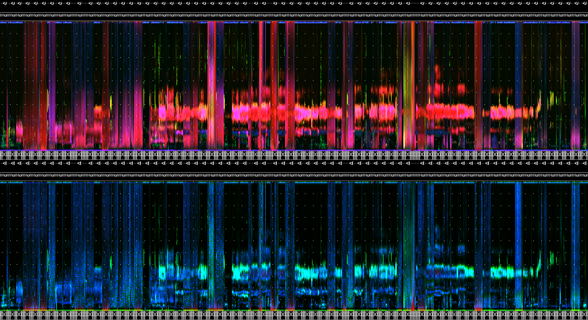

```{r setup, include = FALSE, eval = TRUE}

options(htmltools.dir.version = FALSE)

library(knitr)
library(wildRtrax)
library(tidyverse)

opts_chunk$set(
  #prompt = T,
  fig.align="center", #fig.width=6, fig.height=4.5, 
  # out.width="748px", #out.length="520.75px",
  dpi=300, #fig.path='Figs/',
  cache=T#, echo=F, warning=F, message=F
  )

hook_source <- knitr::knit_hooks$get('source')
knitr::knit_hooks$set(source = function(x, options) {
  x <- stringr::str_replace(x, "^[[:blank:]]?([^*].+?)[[:blank:]]*#<<[[:blank:]]*$", "*\\1")
  hook_source(x, options)
})

```

```{css, echo=FALSE}
/* custom.css */
.left-code {
  color: #777;
  width: 90%;
  height: 92%;
  float: left;
}
.left-code-less {
  color: #777;
  width: 90%;
  height: 92%;
  float: left;
}
.right-plot {
  width: 58%;
  float: right;
  padding-left: 1%;
}
.right-plot-more {
  width: 65%;
  float: right;
  padding-left: 1%;
}
.plot-callout {
  height: 225px;
  width: 450px;
  bottom: 5%;
  right: 5%;
  position: absolute;
  padding: 0px;
  z-index: 100;
}
.plot-callout img {
  width: 100%;
  border: 4px solid #23373B;
}
body, h1, h2, h3, h4, h5, h6, p, ul, ol {
  font-family: "Agenda", sans-serif; /* Replace "Agenda" with the actual font name */
}
.my-one-page-font {
  font-size: 18px;
}
.text-container {
            width: 300px; /* Set the width to your desired value in pixels or other units */
            margin: 0 auto; /* Center the container horizontally */
        }
.main-container { width: 1800px; max-width:2800px;}
.title-slide {
  background-image: url(hex-logo-pipit.png);
  background-position: 100% 0%;
  background-size: 400px;
  padding-left: 100px;  /* delete this for 4:3 aspect ratio */
}

```

# Preface

- We assume you know WildTrax
  - WildTrax is a web-enabled portal designed to manage, store, process, share and discover environmental sensor data
  - WildTrax is developed and maintained by the Alberta Biodiversity Monitoring Institute
  

- We assume you know R
  - R is a programming language mainly used for statistical computing and data analysis
  


---

# What is `wildRtrax`

- An R package for ecologists and advanced users who work with environmental sensors
  + Autonomous recording units (ARUs)
  + Remote cameras
- It contains functions designed to meet most needs in order to organize, analyze and standardize data with the WildTrax infrastructure. 

---

# Why did you build `wildRtrax`?

- `wildRtrax` has been built in parallel with WildTrax to provide additional analytics and functionalities

- By outlining a standardized and harmonized procedure for data intake, quality control, processing and verification of environmental sensor data,`wildRtrax` and WildTrax hope to provide open workflows for using environmental sensors to help answer biological and ecological questions

---

# Who is `wildRtrax`?

- Us

- And YOU! (you'll learn how to make a pull request soon)

---

# Agenda

- Downloading the package
- Pre-processing acoustic data
- Downloading data from WildTrax
- Wrangling camera and acoustic data for analysis

---

Photo page here

---

class: my-one-page-font

# Scanning acoustic data

```{r, echo=F, eval=T, warning=F, message=F}
load("book-110.RData")

```

```{r, echo=T, eval=F, warning=F, message=F}
# Plan futures
future::plan(multisession)

# Scan data
files <- wt_audio_scanner(path = ".", file_type = "wav", extra_cols = F)
```

```{r, echo=F, eval=T}
files

```

---

# Scanning acoustic data

```{r}
files %>%
  names()

```

- `location` (where the recording was taken)
- `recording_date_time` (when the recording was taken)

**`LOCATION_20230528_071000.wav`**

You can also add arguments `extra_cols` (sample rate) or `tz` if you want to force a timezone to the recording.

`wt_audio_scanner(path = '.', file_type = 'wav', extra_cols = T, tz = 'US/Mountain')`

---

# Filtering files

```{r, echo=T, eval=T, message=F, warning=F}
files %>%
  mutate(hour = lubridate::hour(recording_date_time)) %>%
  filter(julian %in% c(140:150),
         hour %in% c(4:8))

```

---

class: my-one-page-font

# Generating acoustic indices

```{r, echo=T, eval=F, warning=F, message=F}
# Use the files tibble to execute AP on them
wt_run_ap(x = files, output_dir = 'ap_outputs', path_to_ap = '/where/you/store/AP')

```

```{r, echo=T, eval=F, warning=F, message=F}
wt_glean_ap(files %>% 
              mutate(hour = lubridate::hour(recording_date_time)) %>%
              filter(between(julian,110,220),
                     hour %in% c(0:3,22:23)), 
            input_dir = ".../ap_outputs", purpose = "biotic")

```

.pull-left[

]

.pull-right[

]

---

# Creating tasks and tags

```{r, eval=F, echo=T, message=F, warning=F}
# Generate tasks from tags
wt_make_aru_tasks(
  files,
  output = "my_tasks.csv",
  task_method = "1SPT",
  task_length = 180
)

```

---

# Creating tasks and tags

## From Songscope

```{r, eval=F, echo=T, warning=F, message=F}
# Generate a tag csv to upload to WildTrax 
wt_songscope_tags(
  input,
  output = "env",
  my_output_file = NULL,
  species_code = "CONI",
  vocalization_type = "CALL",
  score_filter = 50,
  method = "USPM",
  task_length = 180
)

```

---

# Creating tasks and tags

## From Kaleidoscope

```{r, eval=F, echo=T, warning=F, message=F}
# Generate a tag csv to upload to WildTrax 
wt_kaleidoscope_tags(input = files,
                     output = "my_bat_tags.csv"
                     freq_bump = 20000)

```

---

# Another day perhaps...

Other things to try (that we didn't have time for today)

- `wt_signal_level()` detects signals in audio based on amplitude thresholds
- `wt_chop()` divides a large audio file into shorter segments
- `wt_location_distances()` takes input latitude and longitudes and computes the distances between each set of valid points

---

## Handing it off to Marcus!

{width=40%}
---


