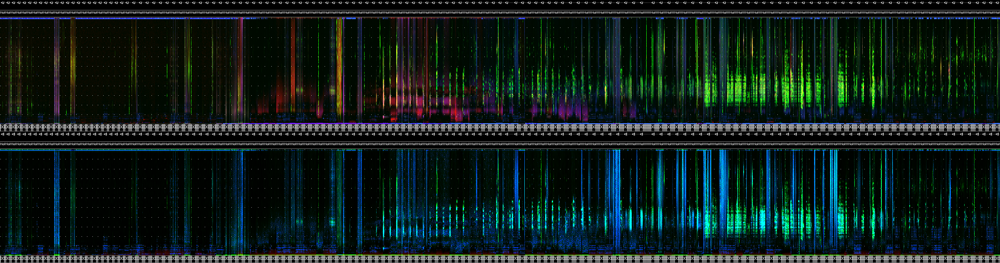
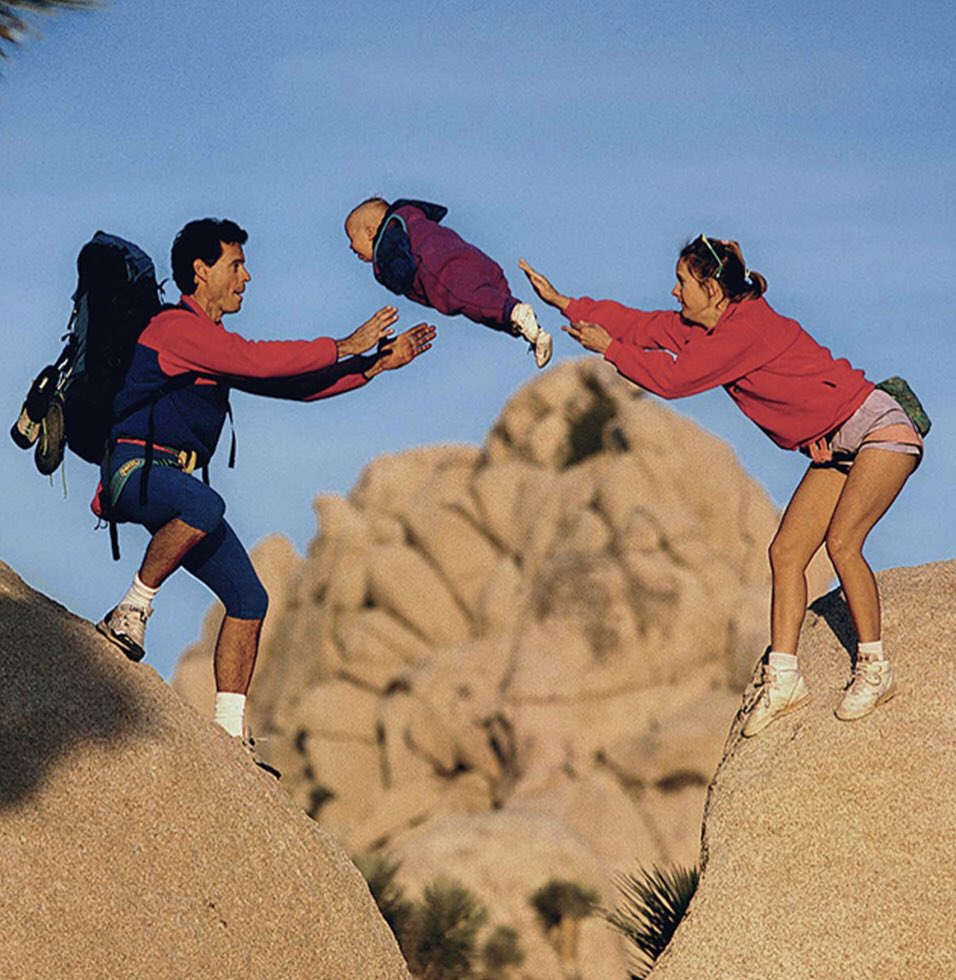

```{r setup, include = FALSE, eval = TRUE}

options(htmltools.dir.version = FALSE)

library(knitr)
library(wildRtrax)
library(tidyverse)

opts_chunk$set(
  #prompt = T,
  fig.align="center", #fig.width=6, fig.height=4.5, 
  # out.width="748px", #out.length="520.75px",
  dpi=300, #fig.path='Figs/',
  cache=T#, echo=F, warning=F, message=F
  )

hook_source <- knitr::knit_hooks$get('source')
knitr::knit_hooks$set(source = function(x, options) {
  x <- stringr::str_replace(x, "^[[:blank:]]?([^*].+?)[[:blank:]]*#<<[[:blank:]]*$", "*\\1")
  hook_source(x, options)
})

```

```{css, echo=FALSE}
/* custom.css */
.left-code {
  color: #777;
  width: 90%;
  height: 92%;
  float: left;
}
.left-code-less {
  color: #777;
  width: 90%;
  height: 92%;
  float: left;
}
.right-plot {
  width: 58%;
  float: right;
  padding-left: 1%;
}
.right-plot-more {
  width: 65%;
  float: right;
  padding-left: 1%;
}
.plot-callout {
  height: 225px;
  width: 450px;
  bottom: 5%;
  right: 5%;
  position: absolute;
  padding: 0px;
  z-index: 100;
}
.plot-callout img {
  width: 100%;
  border: 4px solid #23373B;
}
body, h1, h2, h3, h4, h5, h6, p, ul, ol {
  font-family: "Agenda", sans-serif; font-size: 20px /* Replace "Agenda" with the actual font name */
}
.my-one-page-font {
  font-size: 18px;
}
.text-container {
            width: 300px; /* Set the width to your desired value in pixels or other units */
            margin: 0 auto; /* Center the container horizontally */
        }
.main-container { width: 1800px; max-width:2800px;}
.title-slide {
  background-image: url(hex-logo-pipit.png);
  background-position: 100% 0%;
  background-size: 400px;
  padding-left: 100px;  /* delete this for 4:3 aspect ratio */
}

```

# Preface

- We assume you're using an *environmental sensor* such as an **autonomous recording unit (ARU)** or **remote camera**


- We assume you know *WildTrax*

  - A web-enabled portal designed to manage, store, process, share and discover environmental sensor data, developed by the ABMI


- We assume you know *R*

  - A programming language mainly used for statistical computing and data analysis
  
---

# wildRtrax

## What is `wildRtrax`

- An R package for ecologists and advanced users who work with environmental sensors
  
- Contains functions designed to meet most needs in order to organize, analyze and standardize data with the WildTrax infrastructure

## Why did you build `wildRtrax`?

- `wildRtrax` has been built in parallel<sup>1</sup> with WildTrax to provide additional analytics and functionalities

- By outlining a standardized and harmonized procedure for data intake, quality control, processing and verification of environmental sensor data,`wildRtrax` and WildTrax hope to provide open work flows for environmental sensors to help answer biological and ecological questions

---

## Who is `wildRtrax`?

- Us

- And YOU! (you'll learn how to make a pull request soon)

---

# Today's Agenda

- Installing the package
- Pre-processing acoustic data
- Downloading data from WildTrax
- Wrangling camera and acoustic data for analysis
- Contributing to package and submitting issues

---


---

# Installing the package

`remotes::install_github('ABbiodiversity/wildRtrax')`

Interested in recent fixes? Download the development branch instead:

`remotes::install_github('ABbiodiversity/wildRtrax@development')`

---

class: my-one-page-font

# Scanning acoustic data

```{r, echo=F, eval=T, warning=F, message=F}
load("webinar.RData")

```

```{r, echo=T, eval=F, warning=F, message=F}
# Load the package
library(wildRtrax)

# Plan futures
plan(strategy = multisession)

# Scan data
files <- wt_audio_scanner(path = ".", file_type = "wav", extra_cols = T)
```

```{r, echo=F, eval=T}
files

```

---

# Scanning acoustic data

```{r}
files |>
  names()

```

- `location` (where the recording was taken)
- `recording_date_time` (when the recording was taken)

**`339-NW_20230528_071000.wav`**

You can also add arguments `extra_cols` (sample_rate, length_seconds, n_channels) or `tz` if you want to assign a timezone to the recordings.

`wt_audio_scanner(path = '.', file_type = 'wav', extra_cols = T, tz = 'US/Mountain')`

---

# Filtering files

```{r, echo=T, eval=T, message=F, warning=F}
files |>
  mutate(hour = lubridate::hour(recording_date_time)) |>
  filter(julian %in% c(140:150),
         hour %in% c(4:8))

```

---

class: my-one-page-font

# Generating acoustic indices and LDFCs

```{r, echo=T, eval=F, warning=F, message=F}
# Use the files tibble to execute AP on them
wt_run_ap(x = files, output_dir = 'ap_outputs', path_to_ap = '/where/you/store/AP')

results <- wt_glean_ap(files, input_dir = ".../ap_outputs", purpose = "biotic")

# The indices
results[[2]]

```


---

# LDFC

## Long-duration false-colour spectrogram

```{r, echo=T, eval=F}
results[[3]]
```


---

## Manipulating the results

```{r, echo=T, eval=F}
wt_glean_ap(files %>%
              mutate(hour = lubridate::hour(recording_date_time)) %>%
              filter(hour %in% c(0:3,21:23)), 
            input_dir = "../ap_outputs", purpose = "biotic")
```



---

# Creating tasks and tags

## Upload recordings and generate tasks simulatenously

+ Go to a Project and select Manage > Upload Recordings to Project

```{r, eval=F, echo=T, message=F, warning=F}
# Choose recordings for the ABMI Stratified Design for Ecosystem Health
tasks <- files |>
  inner_join(abmi_blocks, by = c("julian" = "julian", "time_index" = "time_index")) |>
  drop_na(blocks) |>
  group_by(location, blocks) |>
  sample_n(1, replace = F) |>
  ungroup() |>
  map(.x = .$file_path, .f = ~file.copy(.x, to = "/my/selected/files"))
```

---

# Creating tasks and tags

## Upload recordings and create tasks later

+ Go to the Organization > Recordings > Manage > Upload Recordings and create tasks later using `wt_make_aru_tasks()`

```{r, eval=F, echo=T, message=F, warning=F}
my_tasks <- wt_make_aru_tasks(
  tasks %>% 
    select(-c(blocks:recs)),
  output = NULL,
  task_method = "1SPT",
  task_length = 180
)

my_tasks
```

---

# Creating tasks and tags

.left-column[

## From Songscope

```{r, eval=F, echo=T, warning=F, message=F}
# Generate a tag csv to upload to WildTrax 
wt_songscope_tags(
  input,
  output = "env",
  my_output_file = NULL,
  species_code = "CONI",
  vocalization_type = "CALL",
  score_filter = 50,
  method = "USPM",
  task_length = 180
)

```
]

.right-column[

## From Kaleidoscope

```{r, eval=F, echo=T, warning=F, message=F}
# Generate a tag csv to upload to WildTrax 
wt_kaleidoscope_tags(input = "kaleidoscope_output.txt",
                     output = "my_bat_tags.csv"
                     freq_bump = 20000)

```

]
---

# Another day perhaps...

- `wt_signal_level()` detects signals in audio based on amplitude thresholds
- `wt_chop()` divides a large audio file into shorter segments
- `wt_location_distances()` takes input latitude and longitudes and computes the distances between each set of valid points

---

## Handing it off to Marcus!


---

# Authenticating into WildTrax

```{r, echo=TRUE, eval=FALSE, message=FALSE, include=TRUE}

# First we need to set up our username/pass as environment variables
# Note: Need to be `WT_USERNAME` and `WT_PASSWORD`. 

Sys.setenv(WT_USERNAME = "guest", WT_PASSWORD = "Apple123")

```

--

These values live only on your device. But **be careful** about including sensitive information in a script that you may (inadvertently) share!

--

```{r, echo=TRUE, eval=FALSE, message=FALSE, include=TRUE}

# One solution - save a login script file locally
credentials <- "Sys.setenv(WT_USERNAME = 'guest', WT_PASSWORD = 'Apple123')"
writeLines(credentials, "login.R")

# Then, are the top of your data download script, source the file
source("login.R")

```

---

# Authenticating into WildTrax

```{r, echo=TRUE, eval=FALSE, message=FALSE, include=TRUE}

# Second solution - the `keyring` package.

library(keyring)

keyring_create("wildtrax")
key_set("WT_USERNAME", keyring = "wildtrax")
key_set("WT_PASSWORD", keyring = "wildtrax")

# This is now safe for my script!
Sys.setenv(WT_USERNAME = key_get("WT_USERNAME", keyring = "wildtrax"),
           WT_PASSWORD = key_get("WT_PASSWORD", keyring = "wildtrax"))

```

---

# Authenticating into WildTrax

```{r echo=TRUE, eval=TRUE, message=TRUE, include=TRUE, cache = TRUE}

# Now, all you need to do is run one function. With no arguments!!!

wt_auth() #<<

```

---
count:false

# Authenticating into WildTrax

```{r echo=TRUE, eval=FALSE, message=TRUE, include=TRUE, cache = TRUE}

# Now, all you need to do is run one function. With no arguments!!!

wt_auth() 

```
<br>
**So what's going on beneath the hood?**

```{r, echo=TRUE, eval=TRUE, message=TRUE, include=TRUE}

# Upon attachment, wildRtrax creates a new hidden environment (`._wt_auth_env_`) 
# wt_auth() obtains an Auth0 token from WildTrax and stores it in this environment,
# along with some other values. 

str(names(wildRtrax:::._wt_auth_env_)) #<<

```

--

```{r, echo=TRUE, eval=TRUE, message=TRUE, include=TRUE}

# For example, your token expires after 8 hours. Check it's expiry time:
wildRtrax:::._wt_auth_env_$expiry_time #<<

```

---

# So what?

--

### Well, now you can interact with your data directly in R!

```{r, echo=TRUE, eval=TRUE, message=TRUE, include=TRUE, cache = TRUE}

# Your Auth0 token can be supplied to functions that call the WildTrax API. #<<

# Which camera/ARU projects do you have access to? Use the `wt_get_download_summary` function.
my_projects <- wt_get_download_summary( 
  sensor_id = "CAM"
)

# Print
glimpse(my_projects, width = 75)

```

---

# So what?

The **[`wt_download_report()`](https://abbiodiversity.github.io/wildRtrax/reference/wt_download_report.html)** function mimics the data download on the WildTrax website.

You need to supply the `project_id` value, which we can get from **[`wt_get_download_summary()`](https://abbiodiversity.github.io/wildRtrax/reference/wt_get_download_summary.html)**.

--

```{r echo=TRUE, eval=TRUE, message=TRUE, include=TRUE}

# Let's say we're interested in the ABMI's Ecosystem Health project from 2014

# Obtain the project_id value
wt_get_download_summary(sensor_id = "CAM") |>
  filter(project == "ABMI Ecosystem Health 2014") |>
  select(project_id) |>
  pull()

```

---

# Download data directly into R

<br>

```{r, echo=TRUE, eval=FALSE, message=TRUE, include=TRUE}

eh14_raw <- wt_download_report(
  project_id = 205, #<<
  sensor_id = "CAM",
  report = "main", #<<
  weather_cols = FALSE
)

```

```{r, echo=FALSE, eval=TRUE, message=FALSE, include=FALSE, cache = TRUE}

eh14_raw <- wt_download_report(
  project_id = 205,
  sensor_id = "CAM",
  report = "main",
  weather_cols = FALSE
)

```

---

# A nice dataframe!

<br>

```{r}
eh14_raw |> select(1:15) |> glimpse(width = 75) #<<
```

---

# What about two projects at once?

That's easy too!

```{r echo=TRUE, eval=TRUE, message=TRUE, include=TRUE}

# This time, we want ABMI's Camera Model Comparison projects, from
# three separate years. 

model_comp_ids <- wt_get_download_summary(sensor_id = "CAM") |> 
  filter(str_detect(project, "Camera Model Comparison")) |> #<<
  select(project_id) |>
  pull() 

# The object model_comp_ids is a numeric vector
model_comp_ids

```

---

# What about two projects at once?

```{r echo=TRUE, eval=FALSE, message=TRUE, include=TRUE}

# To avoid a for loop ...

library(purrr)

# Now we can feed all 3 values in project_list into `wt_download_report()`.
model_comp_raw <- map_df(.x = model_comp_ids,
                         .f = ~ wt_download_report(
                           project_id = .x,
                           sensor_id = "CAM",
                           report = "main",
                           weather_cols = FALSE))
                         
```


```{r echo=TRUE, eval=TRUE, message=TRUE, include=FALSE, cache = TRUE}

model_comp_raw <- map_df(.x = model_comp_ids,
                      .f = ~ wt_download_report(
                        project_id = .x,
                        sensor_id = "CAM",
                        report = "main",
                        weather_cols = FALSE
                      ))

```

---

# Stitched together nicely

<br>

```{r}

model_comp_raw %>% select(1:15) %>% glimpse(width = 75)

```

---

# So what?

"You've made a slightly slicker version of `read.csv()`. Big deal."

--

<br>

Well, there are benefits to scripting:

+ Always get the most up-to-date version of the data.
+ Your collaborators are working off the same data that you are.
+ Reproducibility! 
+ Storage schmorage. 

--

# Transform our camera data

Most of the time, there are additional steps we want to take to transform our data into something more insightful or useful - for, say, modeling.

--

One common task: evaluating **independent detections**.

--

+ There's a function in wildRtrax for that: [`wt_ind_detect()`](https://github.com/ABbiodiversity/wildRtrax/blob/main/R/wt_ind_det.R).
+ It's designed to work with the output (i.e. raw data) from [`wt_download_report()`](https://github.com/ABbiodiversity/wildRtrax/blob/main/R/wt_summarise_cam.R).
+ You specify the detection threshold. 

--

```{r echo=TRUE, eval=TRUE, message=TRUE, include=TRUE, cache = TRUE}

# Back to the Ecosystem Health 2014 data.

eh14_detections <- wt_ind_detect(
  x = eh14_raw,
  threshold = 30,
  units = "minutes",
  remove_human = TRUE,
  remove_domestic = TRUE
)

```

---
count:false

# Transform our camera data

Most of the time, there are additional steps we want to take to transform our data into something more insightful or useful - for, say, modeling.


One common task: evaluating **independent detections**.


+ There's a function in wildRtrax for that: [`wt_ind_detect()`](https://github.com/ABbiodiversity/wildRtrax/blob/main/R/wt_ind_det.R).
+ It's designed to work with the output (i.e. raw data) from [`wt_download_report()`](https://github.com/ABbiodiversity/wildRtrax/blob/main/R/wt_summarise_cam.R).
+ You specify the detection threshold. 


```{r echo=TRUE, eval=FALSE, message=TRUE, include=TRUE}

# Back to the Ecosystem Health 2014 data.

eh14_detections <- wt_ind_detect(
  x = eh14_raw, #<<
  threshold = 30,
  units = "minutes",
  remove_human = TRUE,
  remove_domestic = TRUE
)

```

---
count:false

# Transform our camera data

Most of the time, there are additional steps we want to take to transform our data into something more insightful or useful - for, say, modeling.


One common task: evaluating **independent detections**.


+ There's a function in wildRtrax for that: [`wt_ind_detect()`](https://github.com/ABbiodiversity/wildRtrax/blob/main/R/wt_ind_det.R).
+ It's designed to work with the output (i.e. raw data) from [`wt_download_report()`](https://github.com/ABbiodiversity/wildRtrax/blob/main/R/wt_summarise_cam.R).
+ You specify the detection threshold. 


```{r echo=TRUE, eval=FALSE, message=TRUE, include=TRUE}

# Back to the Ecosystem Health 2014 data.

eh14_detections <- wt_ind_detect(
  x = eh14_raw, 
  threshold = 30, #<<
  units = "minutes", #<<
  remove_human = TRUE,
  remove_domestic = TRUE
)

```

---
count:false

# Transform our camera data

Most of the time, there are additional steps we want to take to transform our data into something more insightful or useful - for, say, modeling.


One common task: evaluating **independent detections**.


+ There's a function in wildRtrax for that: [`wt_ind_detect()`](https://github.com/ABbiodiversity/wildRtrax/blob/main/R/wt_ind_det.R).
+ It's designed to work with the output (i.e. raw data) from [`wt_download_report()`](https://github.com/ABbiodiversity/wildRtrax/blob/main/R/wt_summarise_cam.R).
+ You specify the detection threshold. 


```{r echo=TRUE, eval=FALSE, message=TRUE, include=TRUE}

# Back to the Ecosystem Health 2014 data.

eh14_detections <- wt_ind_detect(
  x = eh14_raw, 
  threshold = 30,
  units = "minutes",
  remove_human = TRUE, #<<
  remove_domestic = TRUE #<<
)

```

---

# Transform our camera data

```{r echo=TRUE, eval=TRUE, message=TRUE, include=TRUE}

glimpse(eh14_detections, width = 75) #<<

```

--

**307** independent detections in this dataset, when using a threshld of 30 minutes.

---

# Our main engine

The output from `wt_ind_detect()` gave us some useful information. 

--

But we probably need to do additional wrangling for our data to be in the proper format for certain modeling techniques (e.g. habitat modeling, occupancy).

For example, we want to evaluate the number of detections in a specified time interval (e.g. daily, weekly, or monthly), *including zeroes*. 

--

<br>

## So the ⭐ of the show is: [**`wt_summarise_cam()`**](https://github.com/ABbiodiversity/wildRtrax/blob/main/R/wt_summarise_cam.R)

---

# Summarise your camera data

## [**`wt_summarise_cam()`**](https://github.com/ABbiodiversity/wildRtrax/blob/main/R/wt_summarise_cam.R)

<br>

### You specify the following arguments:
<br>
+ The output from `wt_ind_detect()` (e.g. the object `eh14_detections_45s`)

+ Your raw data (e.g. the object `eh14_raw`)

+ The time interval you're interested in (e.g. weekly)

+ The variable you're interested in (e.g. detections, presence/absence)

+ The desired output format ('wide' or 'long')

---

# Summarise your camera data

<br>

```{r eval=FALSE, echo=TRUE, include=TRUE}

# A call to `wt_summarise_cam()`:

eh14_summarised <- wt_summarise_cam(
  detect_data = eh14_detections_45s,
  raw_data = eh14_raw,
  time_interval = "week",
  variable = "detections",
  output_format = "wide"
)

```

---
count:false

# Summarise your camera data

<br>

```{r eval=FALSE, echo=TRUE, include=TRUE}

# A call to `wt_summarise_cam()`:

eh14_summarised <- wt_summarise_cam(
  # Supply your detection data #<<
  detect_data = eh14_detections_45s, #<<
  raw_data = eh14_raw,
  time_interval = "week",
  variable = "detections",
  output_format = "wide"
)

```

---
count:false

# Summarise your camera data

<br>

```{r eval=FALSE, echo=TRUE, include=TRUE}

# A call to `wt_summarise_cam()`:

eh14_summarised <- wt_summarise_cam(
  # Supply your detection data
  detect_data = eh14_detections_45s,
  # Supply your raw image data #<<
  raw_data = eh14_raw, #<<
  time_interval = "week",
  variable = "detections",
  output_format = "wide"
)

```

---
count:false

# Summarise your camera data

<br>

```{r eval=FALSE, echo=TRUE, include=TRUE}

# A call to `wt_summarise_cam()`:

eh14_summarised <- wt_summarise_cam(
  # Supply your detection data
  detect_data = eh14_detections_45s,
  # Supply your raw image data
  raw_data = eh14_raw,
  # Now specify the time interval you're interested in #<<
  time_interval = "week", #<<
  variable = "detections",
  output_format = "wide"
)

```

---
count: false

# Summarise your camera data

<br>

```{r eval=FALSE, echo=TRUE, include=TRUE}

# A call to `wt_summarise_cam()`:

eh14_summarised <- wt_summarise_cam(
  # Supply your detection data
  detect_data = eh14_detections_45s,
  # Supply your raw image data
  raw_data = eh14_raw,
  # Now specify the time interval you're interested in 
  time_interval = "week",
  # What variable are you interested in? #<<
  variable = "detections", #<<
  output_format = "wide"
)

```

---
count: false

# Summarise your camera data

<br>

```{r eval=FALSE, echo=TRUE, include=TRUE}

# A call to `wt_summarise_cam()`:

eh14_summarised <- wt_summarise_cam(
  # Supply your detection data
  detect_data = eh14_detections_45s,
  # Supply your raw image data
  raw_data = eh14_raw,
  # Now specify the time interval you're interested in 
  time_interval = "week",
  # What variable are you interested in?
  variable = "detections",
  # Your desired output format (wide or long) #<<
  output_format = "wide" #<<
)

```
--
### Let's go interactive to really explore all these options.

---

# The ulimate pipeline

```{r eval=FALSE, echo=TRUE, include=TRUE}

library(wildRtrax)
Sys.setenv(WT_USERNAME = "*****",
           WT_PASSWORD = "*****")
wt_auth()


data <- wt_get_download_summary("CAM") %>%
  filter(project == "ABMI Ecosystem Health 2014") %>%
  select(project_id) %>%
  pull() %>%
  unlist() %>%
  wt_download_report("CAM")


summarised <- wt_ind_detect(data, 30, "minutes") %>%
  wt_summarise_cam(data, "day", "detections", "long")

```
--
<br>
**And now you can get straight into the science!!**

---
