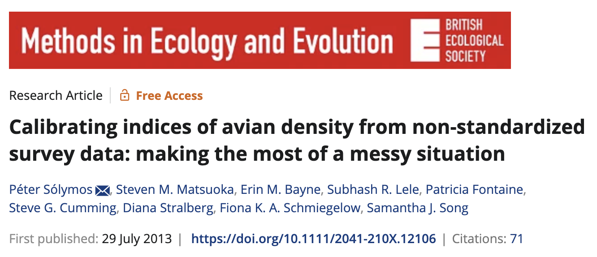
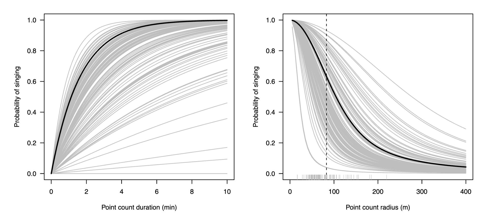

```{r setup, include = FALSE, eval = TRUE}

options(htmltools.dir.version = FALSE)

library(knitr)
library(dplyr)
library(stringr)
library(tidyr)
library(wildRtrax)
library(purrr)
library(ggplot2)

opts_chunk$set(
  #prompt = T,
  fig.align="center", #fig.width=6, fig.height=4.5, 
  # out.width="748px", #out.length="520.75px",
  dpi=300, #fig.path='Figs/',
  cache=T#, echo=F, warning=F, message=F
)

hook_source <- knitr::knit_hooks$get('source')
knitr::knit_hooks$set(source = function(x, options) {
  x <- stringr::str_replace(x, "^[[:blank:]]?([^*].+?)[[:blank:]]*#<<[[:blank:]]*$", "*\\1")
  hook_source(x, options)
})

```

```{css, echo=FALSE}
/* custom.css */
.left-code {
color: #777;
width: 40%;
height: 92%;
float: left;
}
.left-code-less {
color: #777;
width: 25%;
height: 92%;
float: left;
}
.right-plot {
width: 58%;
float: right;
padding-left: 1%;
}
.right-plot-more {
width: 65%;
float: right;
padding-left: 1%;
}
.plot-callout {
height: 225px;
width: 450px;
bottom: 5%;
right: 5%;
position: absolute;
padding: 0px;
z-index: 100;
}
.plot-callout img {
width: 100%;
border: 4px solid #23373B;
}

```

# Part 1: Data Wrangling 

### So now you have some processed acoustic data. Let's look at some convenient wrangling functions to kick-start your analysis

---
# Recall: data download

```{r, echo=TRUE, eval=TRUE, message=FALSE, include=TRUE, cache=TRUE}

# Set our account details and login to WildTrax

source("login.R")
wt_auth()

# What are the projects we can access?

my_projects <- wt_get_download_summary(sensor_id = "ARU") %>% 
  filter(status=="Published - Public") %>% 
  select(-organization_id, -status)

```

---

# PSA

### There is a *LOT* of public acoustic data available in WildTrax!!!

--

```{r, echo=TRUE, eval=TRUE, message=FALSE, include=TRUE}

glimpse(my_projects)

```
**65 projects!**

--

```{r, echo=TRUE, eval=TRUE, message=FALSE, include=TRUE}

sum(my_projects$tasks)

```
**Over 75K tasks!**

---

# Recall: data download

### Ok PSA over, let's get some data

```{r, echo=TRUE, eval=TRUE, message=FALSE, include=TRUE}

# Pick something small
set.seed(12345)
my_project <- my_projects %>% 
  filter(tasks < 200) %>% 
  sample_n(1)

# What did we get?
my_project$project

```

---

# Recall: data download

### Note: The functions we're reviewing today operate on the **main** report

```{r, echo=TRUE, eval=FALSE, message=FALSE, include=TRUE}

# And download
my_data <- wt_download_report(
  project_id = my_project$project_id,
  sensor_id = "ARU",
  reports = "main", #<<
  weather_cols = FALSE
)

```

```{r, echo=FALSE, eval=TRUE, message=FALSE, include=FALSE, cache = TRUE}

source("login.R")
wt_auth()
my_data <- wt_download_report(
  project_id = my_project$project_id,
  sensor_id = "ARU",
  reports = "main",
  weather_cols = FALSE
)

```

---

# Main report structure

### This is a long object; each row is a tag

```{r, echo=TRUE, eval=TRUE, message=FALSE, include=TRUE}

# Let's look at the fields of data we got
colnames(my_data)

```

---

# What species do we have?

### Do we need to do any filtering?

```{r, echo=TRUE, eval=TRUE, message=FALSE, include=TRUE}

my_data %>% 
  dplyr::select(species_common_name, species_code) %>% 
  unique() %>% 
  head(10)

```

---

# wt_tidy_species()

### This function removes species groups that you aren't interested in

We can remove some or all of the following groups:
- mammal (e.g., Red Squirrel)
- amphibian (e.g., Boreal Chorus Frog)
- abiotic (e.g., wind, rain, background noise)
- insect (e.g., crickets)
- bird (why would you want to take these out)
- unknown (e.g., Unidentified Passerine)

---

# wt_tidy_species()

### Let's get just the bird data

```{r, echo=FALSE, eval=TRUE, message=FALSE, include=FALSE}

source("login.R")
wt_auth()
my_tidy_data <- wt_tidy_species(my_data,
                                remove=c("mammal",
                                         "amphibian",
                                         "abiotic",
                                         "insect",
                                         "unknown"),
                                zerofill=TRUE)

```

```{r, echo=TRUE, eval=FALSE, message=FALSE, include=TRUE}

# Let's zerofill to make sure we keep surveys with no birds detected
my_tidy_data <- wt_tidy_species(my_data,
                                remove=c("mammal",
                                         "amphibian",
                                         "abiotic",
                                         "insect",
                                         "unknown"),
                                zerofill=TRUE)

```
.footnote[Note: This function downloads a species table to do the filtering]

---

# wt_tidy_species()

### Let's check our species list again

```{r, echo=TRUE, eval=TRUE, message=FALSE, include=TRUE}

my_tidy_data %>% 
  dplyr::select(species_common_name, species_code) %>% 
  unique() %>% 
  head(10)

```

.footnote[Note: 'NONE' indicates a survey with no birds]

---

# wt_replace_tmmt()

### Let's look at our distribution of counts

```{r, echo=TRUE, eval=FALSE, message=FALSE, include=TRUE}

hist(my_tidy_data$individual_count)

```

```{r, echo=FALSE, eval=TRUE, message=FALSE, include=TRUE}

try(hist(my_tidy_data$individual_count))

```

--

### Uh-oh! Why is count a character value?

--

```{r, echo=TRUE, eval=TRUE, message=FALSE, include=TRUE}

# Look at our count values
table(my_tidy_data$individual_count)

```

---

# Side-bar: what is TMTT?

### TMTT stands for "too many to tag"

"an abbreviation used to indicate an uncountable number of individuals within the bounds of a tag"

--

### Ok, so now what? Options:
- convert data to presence/absence (i.e., 1, 0)
- regex abundance estimates out of comments field (not recommended)
- **wt_replace_tmtt()!**

--

<br />
We've regexed the abundance estimates of the comments field for you!
<br />
And created a model that predicts abundance for TMTT values based on the species and observer of the tag.

---

# wt_replace_tmtt()

### Let's replace our TMTTs then

```{r, echo=TRUE, eval=TRUE, message=FALSE, include=TRUE}

my_tmtt_data <- wt_replace_tmtt(my_tidy_data)

```

--

```{r, echo=FALSE, eval=TRUE, message=FALSE, include=TRUE, fig.width=8, fig.height=4}

ggplot(my_tmtt_data) +
  geom_histogram(aes(x=as.numeric(individual_count))) +
  xlab("Count") +
  ylab("")

```

---

# wt_make_wide()

### Why the weird distribution? Recall that each row is a tag

--

wt_make_wide() aggregates the counts by task and provides a column of counts for each species 

```{r, echo=TRUE, eval=TRUE, message=FALSE, include=TRUE}

# We can filter by sound type (i.e., call or song), let's keep everything
my_wide_data <- wt_make_wide(my_tmtt_data, sound="all")

```

--

```{r, echo=TRUE, eval=TRUE, message=FALSE, include=TRUE}

# Now let's check our first 30 field names
colnames(my_wide_data)[c(1:30)]

```

---

# wt_make_wide()

### Ok and now what does our distribution of counts look like?

--

```{r, echo=FALSE, eval=TRUE, message=FALSE, include=TRUE, fig.width=8, fig.height=4}

# Let's try white-throated sparrow
ggplot(my_wide_data %>% 
         filter(WTSP > 0)) +
  geom_histogram(aes(x=WTSP))  +
  xlab("WTSP count") +
  ylab("")

```


---

# Part 2: Analytics

### The analytics area is under active development! We have 2 tools so far:

.footnote[SPOILER ALERT: This is a great area for contribution!]

--

- wt_format_occupancy(): format data for single species, single season occupancy models in unmarked
- wt_qpad_offsets(): calculate QPAD offsets to account for imperfect detection

---

# wt_format_occupancy()

### This function operates on the long form of the data
i.e., don't use wt_make_wide()

```{r, echo=TRUE, eval=TRUE, message=FALSE, include=TRUE}

# Let's pick our favourite species
my_occu_data <- wt_format_occupancy(my_tmtt_data, species="WTSP", siteCovs = NULL)

```

--

### What do we get for observation covariates?

```{r, echo=TRUE, eval=TRUE, message=FALSE, include=TRUE}

names(my_occu_data@obsCovs)

```

.footnote[Note: Site covariates must be user-supplied, additional observation covariates can be added via collaboration!]

---

#wt_format_occupancy()

### Let's see if detectability varies between observers

```{r, echo=TRUE, eval=TRUE, message=FALSE, include=TRUE}

library(unmarked)

my_occu_model <- occu(~ observer ~ 1,
            my_occu_data)

my_occu_model@estimates@estimates[["det"]]

```

---

# wt_qpad_offsets()

### QPAD is a statistical approach for dealing with imperfect and variable detectability



.footnote[ABMI & the Boreal Avian Modelling (BAM) project both use QPAD in our species distribution models]

---
# wt_qpad_offsets()

### How does it work?

- Availability for detection (phi) is estimated with removal models
- Perceptibility (tau) is estimated with distance models
- Phi and tau are combined to provide values that can be used as statistical offsets in a wide variety of models



---

# wt_qpad_offsets()

### Ok cool, that's useful, how do I get offsets?
- Phi and tau have already been modelled by BAM
- The wt_qpad_offsets() function uses those models to calculate custom offsets for the day, time, and habitat types in your data

--

```{r, echo=TRUE, eval=TRUE, message=FALSE, include=TRUE}

# We can get offsets for all species, or a named subset
my_offset_data <- wt_qpad_offsets(my_wide_data, species=c("OVEN", "WTSP", "YEWA"))

```

---

# wt_qpad_offsets()

### Let's try a model

```{r, echo=TRUE, eval=TRUE, message=FALSE, include=TRUE}

# Let's look at the values
summary(my_offset_data$WTSP)

# Run a simple linear model
my_qpad_model <- lm(WTSP ~ 1, offset=my_offset_data$WTSP, data=my_wide_data)

```


---
# What if I have point count data?

### Functions to convert data from the point count sensor to formats compatible with the existing functions will be available soon.
<br />
### STAY TUNED!


```
